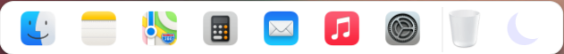

# Taskbar

This library provides a customizable taskbar component for Angular applications.

## Installation

First, install the `Taskbar` library in your Angular project by running:

```bash
npm install taskbar
```

## Usage

### Importing the Taskbar Module

To use the `Taskbar` component in your project, import the `TaskbarModule` in your Angular module:

```typescript
import { TaskbarModule } from 'taskbar';

@NgModule({
  declarations: [
    AppComponent
  ],
  imports: [
    BrowserModule,
    TaskbarModule  // Import the Taskbar module
  ],
  providers: [],
  bootstrap: [AppComponent]
})
export class AppModule { }
```

### Using the Taskbar Component

You can now use the `Taskbar` component in your templates. Here’s an example:

```html
<lib-taskbar [icons]="iconsDock" [showThemeToggle]="true" [fullWidth]="false"
      [backgroundColor]="'rgba(244, 245, 245, 1)'" [darkThemeBackgroundColor]="'rgba(34, 34, 34, 1)'"
      [borderColor]="'rgba(0, 0, 0, 0.2)'" (program)="handleProgramClick($event)"
      (themeToggled)="handleThemeToggle($event)">
</lib-taskbar>
```

In your component's TypeScript file, define the `iconsDock` array and the event handlers:

```typescript
import { Component } from '@angular/core';

export interface Icons {
  icon: string;
  label: string;
  id: string;
}

export const iconsDock: Icons[] = [
  { icon: '/assets/dock/finder.png', label: 'Finder', id: 'FinderComponent' },
  { icon: '/assets/dock/notes.png', label: 'Notes', id: 'NotesComponent' },
  { icon: '/assets/dock/maps.png', label: 'Maps', id: 'MapsComponent' },
  { icon: '/assets/dock/calculator.png', label: 'Calculator', id: 'CalculatorComponent' },
  { icon: '/assets/dock/music.png', label: 'Music', id: 'MusicComponent' },
  { icon: '/assets/dock/preferences.png', label: 'System Preferences', id: 'SystemComponent' },
  { icon: '/assets/dock/bin.png', label: 'Bin', id: 'BinComponent' },
];

@Component({
  selector: 'app-root',
  templateUrl: './app.component.html',
  styleUrls: ['./app.component.css']
})
export class AppComponent {
  iconsDock = iconsDock;

  handleProgramClick(icon: any) {
    console.log('Icon clicked:', icon);
    // Add your custom logic here
  }

  handleThemeToggle(isDarkMode: boolean) {
    console.log('Theme toggled:', isDarkMode ? 'Dark Mode' : 'Light Mode');
    this.themeService.toggleDarkMode();
  }

  constructor(private themeService: ThemeService) {}
}
```

### Screenshot

Below is a screenshot of the `Taskbar` component in action:




